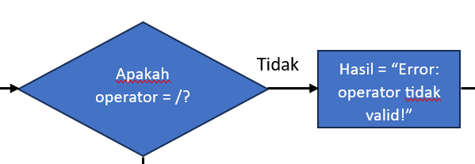
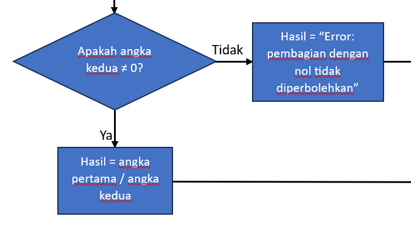

# labpy02_
Nama    : MUHAMAD VALENTINO RAMZI

NIM     : 312410454

Kelas   : TI.24.A.5

Matkul  : Bahasa Pemograman

## membuat program dan flowchart tiket bioskop menggunakan if else dan operator ternary

1.

Titik awal dari flowchart menggunakan simbol oval.

2.

Pengguna diminta untuk menginputkan tipe_tiket (Reguler/VIP).

3.

Pengguna diminta untuk memasukan status_member (Ya/Tidak).

4.

Apakah tipe_tiket tersebut Reguler?

-Jika Ya, maka Harga = 50000.

-Jika tidak, maka Harga = 100000.

5.

Apakah status_member ya?

-Jika Ya, maka Diskon = 0.2.

-Jika Tidak, maka Diskon = 0.

6.

Lalu kita mencari Total_harga dengan mengkali Harga dengan (1 - Diskon) dan hasilnya = Total_harga

7.

Output atau tampilkan Total_harga tersebut.

8.

Dan selesai diakhiri dengan simbol oval.

### Ini adalah flowchartnya:

### Ini adalah Programnya dalam bentuk python:

### Ini adalah hasil dari program yang telah diinputkan:

## Membuat program dan flowchart kalkulator sederhana menggunakan if elif else untuk menentukan operasi aritmatika

1.

Titik awal dari flowchart menggunakan simbol oval.

2.

Pengguna diminta menginputkan angka pertama.

3.

Pengguna diminta untuk menginputkan angka kedua.

4.

Pengguna diminta untuk menginputkan operator (+, -, *, /).

5.

Apakah operator = +?

-Jika Ya, maka Hasil = angka pertama + angka kedua. Dan lanjut ke no10.

-Jika Tidak, maka lanjut ke no6.

6.

Apakah operator = -?

-Jika Ya, maka Hasil = angka pertama - angka kedua. Dan lanjut ke no10.

-Jika Tidak, maka lanjut ke no7.

7.
![gambar] (screenshot/fc8.png)

Apakah operator = *?

-Jika Ya, maka Hasil = angka pertama * angka kedua. Dan lanjut ke no10.

-Jika Tidak, maka lanjut ke no8.

8.

Apakah operator = /?

-Jika Ya, maka lanjut ke no9.

-Jika Tidak, maka Hasil = "Error: operator tidak valid!". Dan lanjut ke no10.

9.

Apakah angka kedua ≠ 0?

-Jika Ya, maka Hasil = angka pertama / angka kedua. Dan lanjut ke no10.

-Jika Tidak, maka Hasil = "Error: pembagian dengan nol tidak diperbolehkan". Dan lanjut ke no10

10.

Lalu output atau tampilkan Hasil.

11.

Dan selesai diakhiri menggunakan simbol oval.

### Ini adalah flowchartnya:

### Ini adalah programnya dalam bentuk python:

### Ini adalah hasil dari program yang telah diinputkan:

